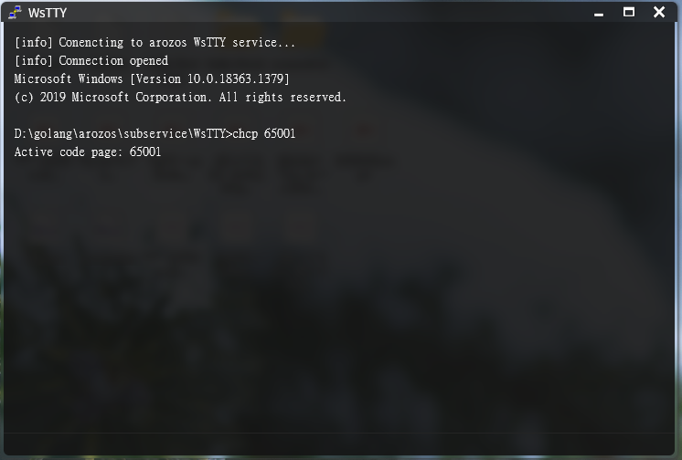
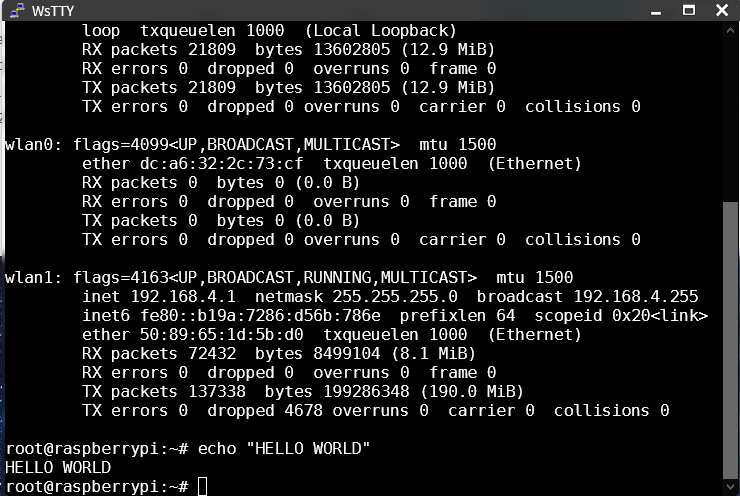

# WsTTY

WebSocket Terminal Module for arozos system

Access your OS terminal from ArozOS Web Desktop Interface

## Deprecated
This subservice is deprecated and replaced by Zoraxy (my another open source project of a feature rich reverse proxy server) Web SSH feature. Checkout Zoraxy repo [here](https://github.com/tobychui/zoraxy).

### Installation

Requires

- Go 1.14 or above
- Windows 7 or above / Debian 10 (Buster) or above

```
#Assume the arozos is installed under ~/arozos
cd ~/arozos/subservice
git clone https://github.com/aroz-online/WsTTY
cd ./WsTTY
./build.sh

#Setup permission, optional but recommended
sudo chmod 755 -R ./
```

### Gotty

This project includes binary compiled from Gotty from https://github.com/yudai/gotty

The license of the compiled binary is included in ./gotty/LICENSE. Those binary are necessary for WsTTY to operate normally under Linux environment

### Wsshell

WsTTY will execute Wsshell under Windows for compatibility mode. This might works a bit different from Gotty. Please use with your own risk.

### Screenshots

WsTTY running under Windows (powered by Wsshell)



WsTTY running under Linux (powered by Gotty)



### License

MIT
